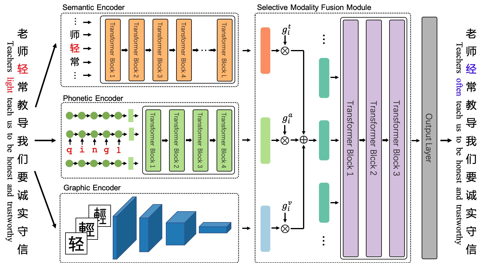

# ReaLiSe+SRF

This repo is midified from https://github.com/DaDaMrX/ReaLiSe, which is the office code for the paper [Read, Listen, and See: Leveraging Multimodal Information Helps Chinese Spell Checking](https://arxiv.org/abs/2105.12306).

ReaLiSe is a multi-modal Chinese spell checking model. 



## Environment
- Python: 3.6
- Cuda: 10.0
- Packages: 
  ```shell
  pip install --editable . 
  pip install -r requirements.txt
  ```

## Data

### Raw Data
SIGHAN Bake-off 2013: http://ir.itc.ntnu.edu.tw/lre/sighan7csc.html  
SIGHAN Bake-off 2014: http://ir.itc.ntnu.edu.tw/lre/clp14csc.html  
SIGHAN Bake-off 2015: http://ir.itc.ntnu.edu.tw/lre/sighan8csc.html  
Wang271K: https://github.com/wdimmy/Automatic-Corpus-Generation

### Data Processing
The code and cleaned data are in the `data_process` directory.

You can also directly download the processed data from [this](https://drive.google.com/drive/folders/1dC09i57lobL91lEbpebDuUBS0fGz-LAk) and put them in the `data` directory. The `data` directory would look like this:
```
data
|- trainall.times2.pkl
|- test.sighan15.pkl
|- test.sighan15.lbl.tsv
|- test.sighan14.pkl
|- test.sighan14.lbl.tsv
|- test.sighan13.pkl
|- test.sighan13.lbl.tsv
```

## Pretrain

- BERT: chinese-roberta-wwm-ext

    Huggingface `hfl/chinese-roberta-wwm-ext`: https://huggingface.co/hfl/chinese-roberta-wwm-ext  
    Local: `/data/dobby_ceph_ir/neutrali/pretrained_models/roberta-base-ch-for-csc/`

- Phonetic Encoder: `pretrain_pho.sh`
- Graphic Encoder: `pretrain_res.sh`
- Merge: `merge.py`

You can also directly download the pretrained and merged BERT, Phonetic Encoder, and Graphic Encoder from [this](https://drive.google.com/drive/folders/14zQ6L6nAumuBqPO3hV3YzWJHHpTSJir2), and put them in the `pretrained` directory:
```
pretrained
|- pytorch_model.bin
|- vocab.txt
|- config.json
```

## Train
```shell
sh realise.sh
```